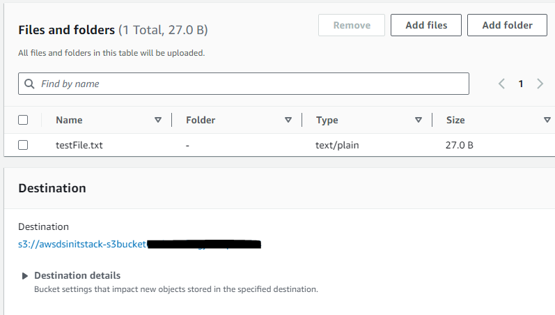
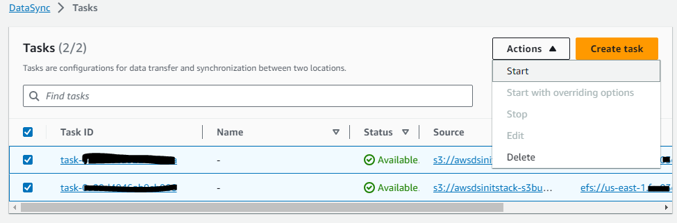
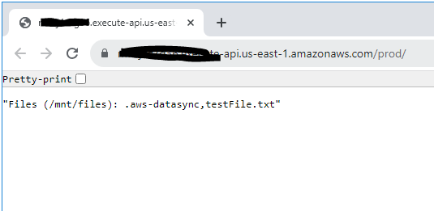

# An Example of moving file objects from AWS S3 to AWS EFS Using AWS DataSync

This example demonstrates how a file can be moved from a S3 bucket to an EFS using AWS DataSync.  This can be very useful if you have any background processes that get files from external systems and your application uses that filesystem to read files without making any additional changes to code.  Although applications will have to mount the EFS volume to read the files, it simplifies existing legacy applications that just need to read a file from FileSystem instead of using S3, S3 SDK, or APIs.  
This project is deployed using AWS CDK in TypeScript.

*Note: The example AWS Transfer Family application (https://github.com/smislam/aws-file-transfer) uses S3 as a destination for simplicity.  It can easily be converted to use EFS instead.  When using AWS Tranasfer Family, if the final destination is EFS, make appropriate changes to your infrastructure code.*

## What does it build?
* Creates a S3 Bucket for source files
* Creates an EFS for destination files
* Creates multiple DataSync tasks to move files between S3 and EFS
* Creates a testing Lambda that reads file list from the EFS volume and Exposes using API Gateway

## Steps to run and test
* Deploy the CDK code. Wait for the deploy to finish.  It will print out the S3 Bucket name and the test API Endpoint.
* Upload a file to the S3 bucket from your local machine (you can use AWS Console as depicted here.  Alternatively, you can use AWS CLI)
  * 
* Currently all tasks are scheduled to be run once at the top of each hour.  If you need to test this feature outside of the run schedule, you will need to run this manually.  Please see: 'AWS DataSync Considerations' section for details.
  * Go to AWS DataSync Console and Start the tasks.  Wait for all the tasks to complete.
  * 
* Click on the API Gateway endpoint to view the file name from EFS.
  * 

## Next Steps
* Add virus scanning before the file is copied to EFS.  Refer to the ClamAV Rest API (https://github.com/smislam/clamav-rest-api) project.

## AWS DataSync Considerations
* Must use CDK L1 constructs
* Can't deploy EFS and DataSync in one Stack.  There are issues with FileSystem gets in creating state causing deploy to fail. [See issue 16826](https://github.com/aws/aws-cdk/issues/16826#issuecomment-1708892070)
* Minimum Task Execution Schedule is One(1) hour.  So if you have files coming in more frequently, you will have to consider additional approach.
* Task Preparation takes a long time for DataSync before it can run the sync jobs.  It will get stuck on `Preparing` state.  This can be scary if you aren't aware of it.
  * [DataSync Task stuck on Preparing](https://docs.aws.amazon.com/datasync/latest/userguide/troubleshooting-datasync-locations-tasks.html#Preparing-status-too-long)
* Only a single instance of each DataSync task can be run at once.  If you have multiple tasks that runs, you will get the dreaded message: `Duplicate scheduled task executions will not be queued.`

